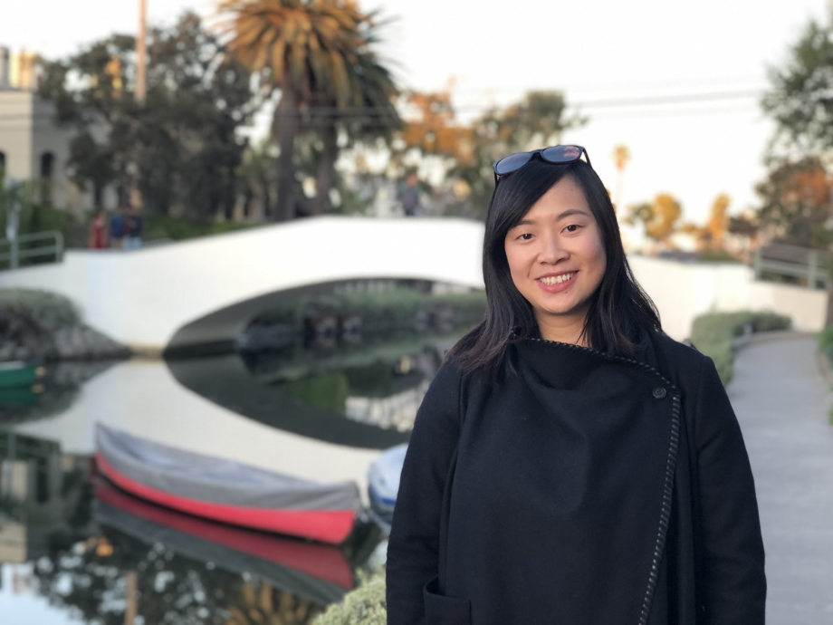

<font size="4">My name is Huiyu (Charlotte) Deng. I'm a PhD candidate in the division of biostatistics of the department of preventive medicine of the University of Southern California. 
\
My research interests are: 

- Develop new machine learning algorithm
- Analyze data from stationary and wearable sensors
- Time series classification
- Air pollution and health science 
- Cancer Epidemiology

</font>

\
\
\
\
```{r, echo=FALSE, out.width = "50%", fig.align = "center"}

```

